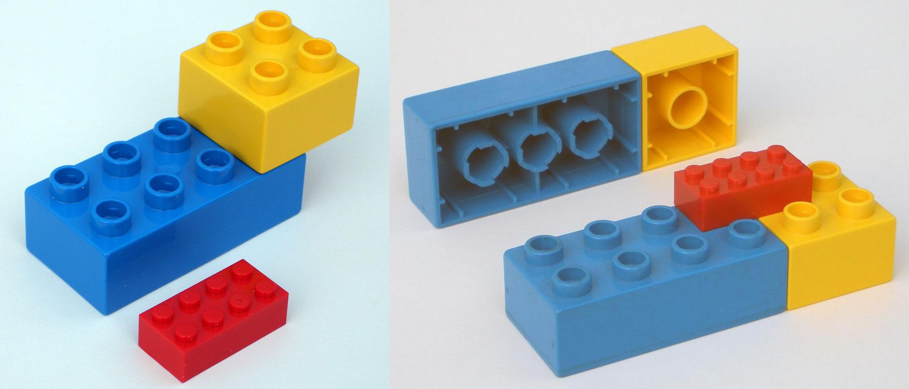

Qui n'a jamais été frustré d'un kit de construction qui s'assemble mal ?  

En effet, s'il y a une erreur d'alignement entre deux pièces lors d'un assemblage, à chaque fois que nous ajouterons une pièce à cet assemblage, les erreurs s’additionneront jusqu'à rendre impossible l'ajout de nouvelles pièces.

Et pourtant, cela ne se produit jamais avec les briques Lego !

Le record du monde de [la plus grande tour Lego répertoriée par le Guiness World Records](https://www.guinnessworldrecords.com/world-records/tallest-structure-built-with-interlocking-plastic-bricks) à ce jour a été construite à Milan en Italie à partir de 550 000 briques et fait 35 mètres de haut.

Quelle est l'origine de cette surprenante précision dans l'alignement des pièces Lego ?

La raison est très astucieuse et vient de l'élasticité de la brique et d'un couplage cinématique particulier.

Avez-vous déjà observé attentivement une brique Lego ?
Vous remarquerez que les parois sont un peu flexibles, il y a des stries, des tubes et des protubérances.

Emboîtez deux pièces Lego et observez. Combien de points de contacts y a-t-il entre les 2 pièces ? A bien y regarder, il y en a 3 par protubérance.

En mécanique, un objet possède 6 degrés de liberté, 3 degrés de translation et 3 degrés de rotation. Si l'on veut contraindre totalement un objet, il faut bloquer chacun de ces degrés de liberté.

Pour bloquer une pièce de Lego, il faut donc 6 points de contacts, c'est-à-dire 2 protubérances encastrées.

Mais lorsque l'on joue au Lego, ce sont des dizaines de protubérances qui sont encastrées, nous avons un système qui est surcontraint. Ce n'est pas quelque chose d'habituel lorsque l'on fait du travail mécanique de précision où la tendance est plutôt à restreindre les contraintes au stricte minimum pour éviter les distorsions notamment.

Dans le cas des Lego, Alexandre Slocum du Precision Engineering Research Group à MIT a démontré que surcontraindre les pièces en les assemblant augmente la précision d'alignement [[1]](http://pergatory.mit.edu/kinematiccouplings/documents/Papers/Kinematic%20alignment%20of%20wafers.pdf). Ceci provient de la flexibilité et de la tolerance choisie lors de la conception des pièces. En assemblant les pièces, les erreurs de conception s'annulent et un ajustement extrêmement précis, sous micrométrique, peut être obtenu. C'est ce que l'on appelle un
***couplage par moyennage élastique*** (*elastically averaged coupling*).

Alexandre Slocum et son équipe ont positionné et repositionné des pièces Lego les unes sur les autres un grand nombre de fois et ont ainsi mesuré la répétabilité du positionnement, ce qui définit la précision de l'assemblage.

Pour l'anecdote amusante, les chercheurs ont remarqué que la machine spécifique de laboratoire, utilisée pour mesurer avec précision des positions, une [*Coordinate Measurement Machine CMM*](Coordinate Measurement Machine CMM) qui a coûté un demi million de dollars, était moins précise que l'assemblage de Lego !

Leur conclusion est sans appel, la répétabilité (précision) du positionnement d'un couplage par moyennage élastique est inversement proportionnel au nombre de points de contact.

Une brique Lego produite par injection plastique est précise à environ 20 micromètres. Et lorsqu'elles sont assemblées, des précisions de l'ordre du micromètre peuvent être atteintes.

Un très bel encouragement à la [recherche de simplicité et de frugalité]({{site.url}}entrepreneuriat-social-et-science-frugale/).

Ce principe de couplage a déjà été utilisé pour la confection d'un microscope origami à très bas coût avec des caractéristiques proches des microscopes de laboratoire [[2]](https://journals.plos.org/plosone/article?id=10.1371/journal.pone.0098781).

Dans les fablabs, les imprimantes 3D que l'ont peut rencontrer tel que les Prusa MK3S ont une précision de 0.1mm sur l'axe vertical et 0.3mm sur les axes X et Y horizontaux [[3]](https://help.prusa3d.com/en/article/faq-frequently-asked-questions_1932).

Pourrions-nous avec ces imprimantes construire des machines ou des pièces mécaniques plus précises que la machine qui les a produite ?

Exploiter les capacités du couplage par moyennage élastique serait un avantage indéniable pour construire de nouvelles machines low-cost. Les scientifiques notamment ont souvent un grand besoin de précision. Ceci pourrait donc s'avérer être une aubaine pour démocratiser du matériel de laboratoire fiable et précis. Un challenge auquel nous nous attaquons au labo FrugalLab du FabLab ULB.
